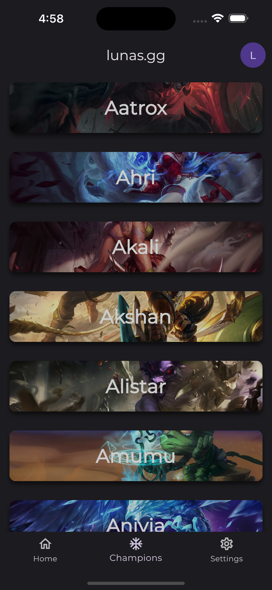
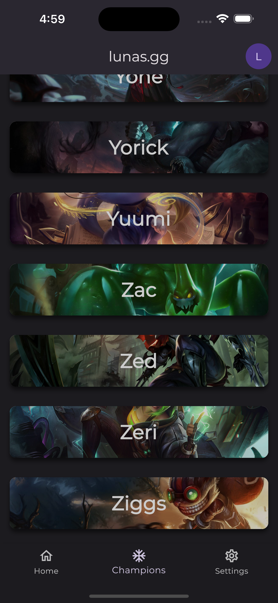
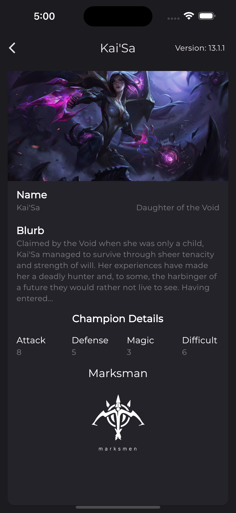
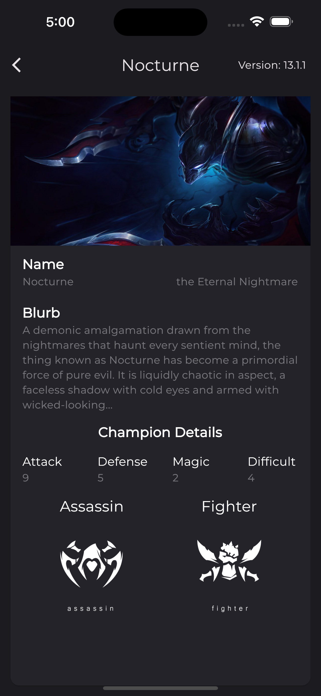

# League of Legends Fetch JSON-API

I made this project to fetch json files, do some model classes and show those with UI/UX app.

## Screenshots
### First Screen

| First Screen       |  First Screen          |
| ------------- |:-------------:|
|      |  |

### Second Screen

| First Screen       |  First Screen          |
| ------------- |:-------------:|
|      |  |
